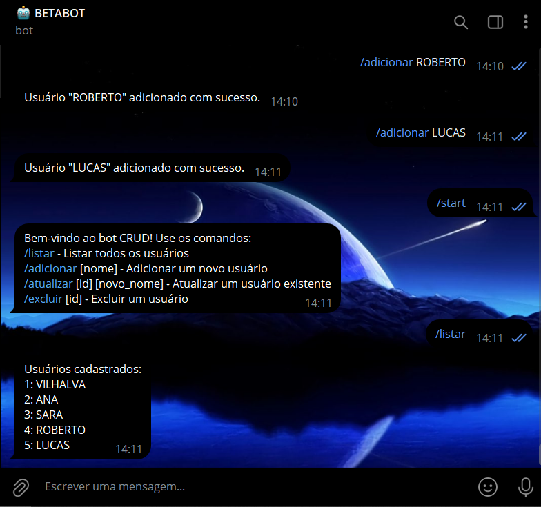
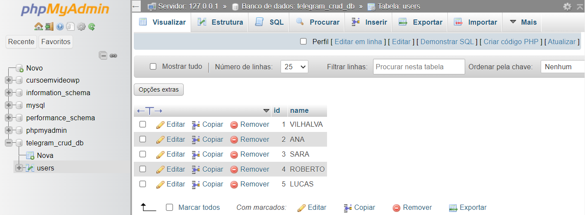

# CRUD COM TELEGRAF
🤤ESSE É UM BOT DO TELEGRAM DE CRUD DE NOMES COM TELEGRAF (NODEJS/JS) E MYSQL!

 <br>
 <br>

## DESCRIÇÃO:
Este bot Telegram com CRUD conectado ao MySQL oferece funcionalidades básicas para gerenciar uma lista de usuários através de comandos específicos. 

Este bot oferece um ponto de partida sólido para desenvolver aplicativos mais complexos usando Telegram, Node.js e MySQL, especialmente aqueles que exigem interações de CRUD com um banco de dados.

## FUNCIONALIDADES:
1. **Comando /start:**
   - Inicia o bot e fornece uma mensagem de boas-vindas com instruções sobre como usar os comandos disponíveis.

2. **Comando /listar:**
   - Lista todos os usuários cadastrados no banco de dados.
   - Exibe o ID e o nome de cada usuário encontrado.
   - Se nenhum usuário estiver cadastrado, exibe uma mensagem informando que nenhum usuário foi encontrado.

3. **Comando /adicionar [nome]:**
   - Adiciona um novo usuário ao banco de dados com o nome especificado após o comando.
   - Exibe uma mensagem de confirmação se o usuário foi adicionado com sucesso.
   - Se nenhum nome for especificado, o bot solicita que o usuário forneça um nome válido.

4. **Comando /atualizar [id] [novo_nome]:**
   - Atualiza o nome de um usuário existente no banco de dados, identificado pelo ID.
   - Exibe uma mensagem de confirmação se o nome do usuário foi atualizado com sucesso.
   - Se o ID ou o novo nome não forem especificados corretamente, o bot solicita que o usuário forneça os parâmetros corretos.

5. **Comando /excluir [id]:**
   - Exclui um usuário do banco de dados, identificado pelo ID.
   - Exibe uma mensagem de confirmação se o usuário foi excluído com sucesso.
   - Se o ID não for especificado corretamente, o bot solicita que o usuário forneça o ID válido do usuário a ser excluído.

## EXECUTANDO O PROJETO:
1. **Configuração do Banco de Dados:**
   - Antes de executar o bot, é necessário importar o arquivo `CODIGO/DATABASE.sql`.

2. **Editar o código:**
   - Certifique-se de substituir "seu_token", "localhost", "seu_usuario" e "sua_senha" pelas informações corretas das suas credenciais no `CODIGO/.env`.

3. **Instalando as Depêndencias:**
   - Para instalar as dependências listadas no arquivo "package.json", você pode usar o comando `npm install` no terminal. Certifique-se de estar no diretório do seu projeto onde o arquivo "package.json" está localizado (`CODIGO`). O npm irá ler o arquivo "package.json" e instalar todas as dependências listadas nele. 

   ```bash
   npm install
   ```

4. **Inicie o Bot:**
   - Execute o bot do Telegram iniciando-o com o seguinte comando:
    ```bash
    node start
    ```

5. **Interagindo com o Bot:**
   1. **Iniciar o Bot:**
      - Envie o comando `/start` para iniciar o bot e receber as instruções de uso.

   2. **Listar Usuários:**
      - Envie o comando `/listar` para ver a lista de todos os usuários cadastrados.

   3. **Adicionar Novo Usuário:**
      - Envie o comando `/adicionar [nome]`, substituindo `[nome]` pelo nome do usuário que deseja adicionar. Por exemplo: `/adicionar João`.

   4. **Atualizar Nome do Usuário:**
      - Envie o comando `/atualizar [id] [novo_nome]`, substituindo `[id]` pelo ID do usuário que deseja atualizar e `[novo_nome]` pelo novo nome desejado. Por exemplo: `/atualizar 1 José`.

   5. **Excluir Usuário:**
      - Envie o comando `/excluir [id]`, substituindo `[id]` pelo ID do usuário que deseja excluir. Por exemplo: `/excluir 1`.

## NÃO SABE?
- Entendemos que para manipular arquivos em muitas linguagens e tecnologias relacionadas, é necessário possuir conhecimento nessas áreas. Para auxiliar nesse aprendizado, oferecemos cursos gratuitos disponíveis:
* [CURSO DE TELEGRAF](https://github.com/VILHALVA/CURSO-DE-TELEGRAF)
* [CURSO DE MYSQL](https://github.com/VILHALVA/CURSO-DE-MYSQL)
* [CURSO DE NODEJS](https://github.com/VILHALVA/CURSO-DE-NODEJS)
* [CONFIRA MAIS CURSOS](https://github.com/VILHALVA?tab=repositories&q=+topic:CURSO)

## CREDITOS:
- [PROJETO CRIADO PELO VILHALVA](https://github.com/VILHALVA)

